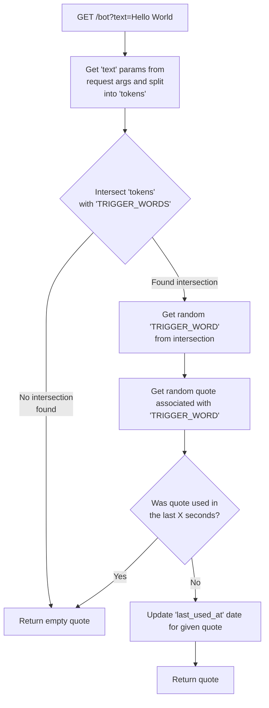

# Backend API

Very simple HTTP web server build on Python 3.7, using [Starlette](https://www.starlette.io/), an ASGI Framework.

Its main job is to expose an endpoint to return Gustavo Santos quotes 😂.


## Install 

To just run the backend api you must install [docker](https://docs.docker.com/get-docker/) and run the following:

```shell script
# Build and run project
~/santosbot/backend $ docker build -t backend:latest .
~/santosbot/backend $ docker run --rm -it -v $(PWD):/app -p 8888:8888 backend:latest 
```

## Usage

This api exposes three endpoints:

| Endpoint | Description |
| ----- | ----- | 
| **GET** `/version` | Return Api version | 
| **GET** `/words` | Return key-value pair of all available "trigger words", with the value being the last time it was used |
| **GET** `/bot?text="example sentence"` | Return quote, if available, for given `text` argument |  


### How does it work?

All quotes were generated using the [jupyter notebook](https://jupyter.org/) on **"~/santosbot/backend/utils/Gustavo Santos Quote Extractor.ipynb"**, 
which is simply extracting all quotes found on http://www.citador.pt/frases/citacoes/a/gustavo-santos/ and creating a dictionary that can be found on **"~/santosbot/backend/api/quotes.py"**

Simply put the logic behind the `/bot` endpoint is the following:



> Github doesn't support ["Mermaid JS"](https://mermaidjs.github.io/#/) [*yet*](https://github.community/t5/How-to-use-Git-and-GitHub/Feature-Request-Support-Mermaid-markdown-graph-diagrams-in-md/td-p/21967#), 
> because of that we need to install ["Github + Mermaid"](https://chrome.google.com/webstore/detail/github-%20-mermaid/goiiopgdnkogdbjmncgedmgpoajilohe) chrome extension to be able to render this diagram. 


