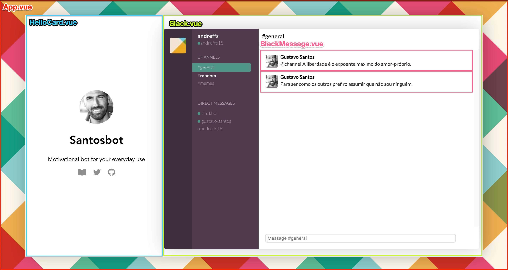

# Frontend App

VueJS app that serves a simple slack-alike interface to showcase Gustavo Santos bot functionality


## Install 

Simply install all npm dependencies to setup the frontend app

```shell script
~/santosbot/frontend $ npm install 

~/santosbot/frontend $ npm run serve
```


## Usage

There are only 3 available commands, which are the same ones that come with seting up a default VueJS app:

- `npm run serve` : for development use only,Compiles and hot-reloads for development
- `npm run dist` : build project on /dist/ folder all static files ready to deploy to CDN, Compiles and minifies for production
- `npm run lint` : runs eslint (pretty plugin) on all vue files and fixes accordingly Lints and fixes files 


### Dockerfile

Note that this project has a Dockerfile, which you can run aswell

```shell script
# Build and run project, on port 8080
~/santosbot/frontend $ docker build -t frontend:latest .
~/santosbot/frontend $ docker run --rm -it -v $(PWD):/app -v /app/node_modules --env-file .env -p 8080:8080 frontend:latest 


```


### Project Structure

All frontend code can be found on /frontend/src/ directory and is organized the following way

```shell script
# ~/santosbot/frontend
.
├── Dockerfile
├── README.md
├── babel.config.js
├── package-lock.json
├── package.json
├── public
│   ├── favicon.ico
│   └── index.html
├── src
│   ├── App.vue
│   ├── assets
│   │   ├── css
│   │   └── images
│   ├── components
│   │   ├── HelloCard.vue
│   │   ├── Slack.vue
│   │   └── SlackMessage.vue
│   └── main.js
└── vue.config.js

```


All webpages components are described below:


